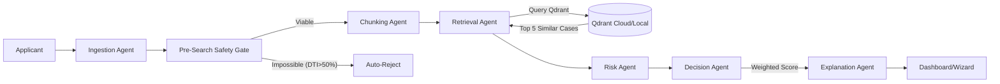

# Credit Decision ADK (Agent Development Kit)

A high-performance, multi-agent credit screening platform that replaces rigid rule-based underwriting with an intelligent, weighted-risk decision engine. This system leverages **Qdrant** for vector-based historical analysis and **Google Gemini** (via OpenRouter) for explainable AI reasoning.

---

## 🚀 Objectives
-   **Replace Rigid Cutoffs**: Move beyond hard credit score floors (e.g., "Reject all < 600") to a **Weighted Risk Multiplier** model that evaluates the whole financial picture.
-   **Automate Manual Review**: Use vector search to find "Similar Historical Cases" and determine if a borderline applicant behaves like a good payer or a defaulter.
-   **Explainable AI**: Provide transparent, regulator-friendly explanations (e.g., "Approved because exceptional DTI compensates for low credit score").

## 🛠️ Technology Stack

| Component | Technology | Version |
| :--- | :--- | :--- |
| **Language** | Python | 3.12 |
| **Orchestration** | Multi-Agent Pipeline | Custom ADK |
| **Vector Database** | **Qdrant** | 1.7.0+ |
| **Embeddings** | FastEmbed (`bge-small-en-v1.5`) | 0.2.0+ |
| **LLM (Reasoning)** | Google Gemini / OpenRouter | API |
| **Frontend** | Vanilla JS / Glassmorphism CSS | ES6+ |
| **Monitoring** | Custom Audit Logger | Internal |

---

## 🏗️ Architecture

The system uses a **Sequential Multi-Agent Pipeline** to process applications:



### Project Hierarchy
```text
credit-decision-adk/
├── agents/                 # Intelligent specialized agents
│   ├── decision_agent.py   # Weighted risk logic (1.5x/2.0x multipliers)
│   ├── retrieval_agent.py  # Qdrant vector search implementation
│   ├── risk_agent.py       # Bayesian probability aggregation
│   └── ...
├── data/                   # SQLite database and CSV schemas
├── monitoring/             # Audit logs and model performance tracking
├── static/                 # Frontend assets (Glassmorphism CSS, JS)
├── templates/              # HTML Jinja2 templates
├── multi_agent_pipeline.py # Core orchestrator
├── app.py                  # Flask web server entry point
├── requirements.txt        # Python dependencies
└── README.md               # Project documentation
```

---

## 🧠 Qdrant Integration
Qdrant is the core "Memory" of the system, enabling it to learn from history.

1.  **Vectorization**: The `ChunkingAgent` converts application data (Debt, Income, Loan Purpose, etc.) into a semantic string and embeds it using **FastEmbed (`BAAI/bge-small-en-v1.5`)** into a 384-dimensional vector.
2.  **Collection**: Data is stored in a Qdrant collection named `credit_decisions`.
3.  **Similarity Search**: The `RetrievalAgent` queries Qdrant for the **Top 5 Nearest Neighbors** (Cosine Similarity).
    -   *Logic*: If the 5 most mathematically similar past applicants all defaulted, the current applicant is High Risk.
4.  **Hybrid Filter**: Search is filtered by hard constraints (e.g., "Must be same state", "Must be similar loan amount") to ensure relevance.

---

## ⚡ Setup & Installation

### Prerequisites
-   Python 3.10+
-   Docker (for Qdrant) is recommended, or run Qdrant locally/cloud.

### 1. Clone & Install
```bash
git clone https://github.com/Dhieaaldin/credit-decison-ADK.git
cd credit-decison-ADK
python -m venv venv
# Windows:
venv\Scripts\activate
# Mac/Linux:
# source venv/bin/activate

pip install -r requirements.txt
```

### 2. Configure Environment
Create a `.env` file in the root:
```ini
OPENROUTER_API_KEY=your_key_here
QDRANT_HOST=localhost
QDRANT_PORT=6333
FLASK_ENV=development
```

### 3. Start Qdrant (Docker)
```bash
docker run -p 6333:6333 qdrant/qdrant
```

### 4. Seed Database (Optional)
Populate the vector database with synthetic historical data:
```bash
python scripts/seed_db.py
```

### 5. Run the Application
```bash
python app.py
```
Access the dashboard at `http://localhost:5000`.

---

## 🖥️ Usage & Validation

### 1. Pre-screening Demo (Safety Gates)
-   Go to **New Application**.
-   Enter **Annual Income: $30,000** and **Loan Amount: $70,000**.
-   **Result**: The UI instantly blocks meaningful submission with "Income Insufficiency" warning.

### 2. "Borderline Approval" Demo (The "Dhia" Case)
-   Click **Fill Demo Data** (console command `fillDemoData()` available in dev tools).
-   Set **Credit Score** to `599`.
-   Set **DTI** to `6.9%`.
-   **Submit**: The system will **APPROVE** (or recommend Manual Review) instead of auto-rejecting, citing *"Exceptional debt-to-income resilience compensates for borderline credit score."*

### 3. Audit Trail
-   Navigate to the **History** tab.
-   Click any case to see the **Technical Audit** view.
-   Verify the **Risk Bars** and **Raw Input Data** match the decision logic.
