# Credit Decision ADK - Comprehensive Project Report

## Executive Summary

**Credit Decision ADK** is an advanced, multi-agent automated loan screening system designed to provide deep cognitive analysis of credit applications. The system leverages semantic vector search and a pipeline of specialized AI agents to evaluate risk, retrieve similar historical cases, and provide human-readable explanations for credit decisions.

---

## 1. System Overview

### 1.1 Purpose
The system automates the loan application screening process by:
- Ingesting and validating loan application data
- Decomposing applications into semantic dimensions
- Finding similar historical cases using vector similarity search
- Computing multi-dimensional risk scores
- Making approve/reject recommendations
- Generating human-readable explanations

### 1.2 Architecture


---

## 2. Technology Stack

| Component | Technology | Purpose |
|-----------|-----------|---------|
| **Backend Framework** | Flask | Web API server |
| **Embedding Model** | FastEmbed (BAAI/bge-small-en-v1.5) | Text embeddings (384 dimensions) |
| **Vector Database** | Qdrant | Similarity search & historical case storage |
| **AI Explanations** | OpenRouter / Google Gemini (optional) | Natural language generation |
| **Semantic Chunking** | Custom implementation | Domain-specific segmentation |
| **Parallelization** | Python multiprocessing | Dataset ingestion acceleration |

---

## 3. Multi-Agent Pipeline

The system follows a sequential multi-agent pipeline with 6 specialized agents:

### 3.1 Agent Overview

```mermaid
flowchart TB
    subgraph Pipeline["Multi-Agent Pipeline"]
        IA["🔍 Ingestion Agent<br/>Data Validation & Normalization"]
        CA["📊 Chunking Agent<br/>Semantic Segmentation"]
        RA["🔎 Retrieval Agent<br/>Vector Similarity Search"]
        RIA["⚠️ Risk Agent<br/>Risk Analysis & Anomaly Detection"]
        DA["✅ Decision Agent<br/>Credit Decision"]
        EA["💬 Explanation Agent<br/>Report Generation"]
    end
    
    IA --> CA --> RA --> RIA --> DA --> EA
```



---

## 4. Agent Specifications

### 4.1 Ingestion Agent (`ingestion_agent.py`)

**Role:** Data Validation & Normalization

**Input:** Raw loan application data

**Output:** Cleaned and validated data

#### Validation Rules

| Rule Type | Fields | Description |
|-----------|--------|-------------|
| **Required Fields** | `loan_amount`, `annual_income`, `debt_to_income`, `emp_title`, `state` | Must be present and non-null |
| **Numeric Validation** | `loan_amount`, `annual_income`, `debt_to_income`, `total_credit_lines`, `open_credit_lines` | Must be valid numeric values |
| **State Validation** | `state` | Must be valid US state code (50 states) |

#### Valid State Codes
All 50 US states are supported:
```
AL, AK, AZ, AR, CA, CO, CT, DE, FL, GA, HI, ID, IL, IN, IA, KS, KY, LA, ME, MD,
MA, MI, MN, MS, MO, MT, NE, NV, NH, NJ, NM, NY, NC, ND, OH, OK, OR, PA, RI, SC,
SD, TN, TX, UT, VT, VA, WA, WV, WI, WY
```

---

### 4.2 Chunking Agent (`chunking_agent.py`)

**Role:** Semantic Segmentation

**Input:** Cleaned loan application data

**Output:** 6 semantic chunks (dimensions)

#### Semantic Dimensions

| Dimension | Description | Key Fields |
|-----------|-------------|------------|
| **Income Stability** | Employment and income profile | `emp_title`, `emp_length`, `annual_income`, `verified_income` |
| **Credit Behavior** | Credit history and utilization | `earliest_credit_line`, `total_credit_lines`, `open_credit_lines`, `total_credit_limit`, `total_credit_utilized`, `delinq_2y`, `inquiries_last_12m` |
| **Debt Obligations** | Debt burden and payment history | `debt_to_income`, `num_historical_failed_to_pay`, `months_since_90d_late`, `current_accounts_delinq`, `total_collection_amount_ever` |
| **Recent Behavior** | Recent credit activity | `accounts_opened_24m`, `num_collections_last_12m`, `months_since_last_credit_inquiry`, `num_accounts_30d_past_due`, `num_accounts_120d_past_due` |
| **Account Portfolio** | Account composition | `num_total_cc_accounts`, `num_open_cc_accounts`, `num_cc_carrying_balance`, `num_mort_accounts`, `current_installment_accounts` |
| **Loan Context** | Loan request details | `loan_purpose`, `application_type`, `loan_amount`, `term`, `homeownership`, `state` |

---

### 4.3 Retrieval Agent (`retrieval_agent.py`)

**Role:** Vector Similarity Search

**Input:** Semantic chunks with embeddings

**Output:** Similar historical loan cases

#### Configuration

| Parameter | Default | Description |
|-----------|---------|-------------|
| **Primary Backend** | Qdrant | Local or remote vector database |
| **Alternative Backend** | Google Vertex AI | Cloud-based vector search (optional) |
| **Top-K Results** | 20 | Number of similar cases per dimension |
| **Qdrant URL** | `http://localhost:6333` | Default Qdrant server |

---

### 4.4 Risk Agent (`risk_agent.py`)

**Role:** Fraud Detection & Risk Analysis

**Input:** Similar historical cases

**Output:** Risk scores and anomaly flags

#### Risk Thresholds

| Threshold | Value | Description |
|-----------|-------|-------------|
| **High Default Rate** | 40% | Applications with > 40% default rate among similar cases are HIGH risk |
| **Low Default Rate** | 15% | Applications with < 15% default rate are LOW risk |
| **Low Similarity** | 0.5 | Average similarity < 0.5 triggers LOW_SIMILARITY anomaly |
| **High DTI** | 40% | Debt-to-income > 40% triggers HIGH_DEBT_TO_INCOME anomaly |
| **High Collections** | $10,000 | Collections > $10,000 triggers HIGH_COLLECTIONS anomaly |

#### Risk Level Classification


#### Anomaly Detection

| Anomaly Type | Severity | Trigger Condition |
|--------------|----------|-------------------|
| **LOW_SIMILARITY** | HIGH | Overall average similarity < 0.5 (unusual application) |
| **CONFLICTING_SIGNALS** | MEDIUM | ≥ 3 dimensions with MEDIUM risk level |
| **HIGH_DEBT_TO_INCOME** | HIGH | DTI ratio > 40% |
| **HIGH_COLLECTIONS** | MEDIUM | Total collections > $10,000 |
| **CURRENT_DELINQUENCIES** | HIGH | Any currently delinquent accounts |

---

### 4.5 Decision Agent (`decision_agent.py`)

**Role:** Credit Decision Making

**Input:** Risk scores and anomalies

**Output:** Decision (APPROVE/REJECT/MANUAL_REVIEW) with confidence

#### Decision Rules

```mermaid
flowchart TD
    START[Start Decision Process] --> A{Default Rate > 40%?}
    A -->|Yes| REJECT[❌ REJECT]
    A -->|No| B{High-Severity Anomalies ≥ 2?}
    B -->|Yes| REJECT
    B -->|No| C{Default Rate < 15%?}
    C -->|Yes| D{High-Severity = 0?}
    D -->|Yes| E{Medium-Severity ≤ 1?}
    E -->|Yes| APPROVE[✅ APPROVE]
    E -->|No| MANUAL[⚠️ MANUAL_REVIEW]
    D -->|No| MANUAL
    C -->|No| MANUAL
```



#### Decision Thresholds

| Threshold | Value | Description |
|-----------|-------|-------------|
| **Approve Threshold** | < 15% default rate | Low risk applications are auto-approved |
| **Reject Threshold** | > 40% default rate | High risk applications are auto-rejected |
| **Max High-Severity Anomalies** | 1 | More than 1 high-severity anomaly triggers rejection |

#### Confidence Calculation

| Decision | Confidence Formula |
|----------|-------------------|
| **REJECT** | `min(0.9, 0.5 + (default_rate × 0.3) + (high_anomalies × 0.1))` |
| **APPROVE** | `min(0.9, 0.6 + (1 - default_rate) × 0.2)` |
| **MANUAL_REVIEW** | Fixed at 60% |

---

### 4.6 Explanation Agent (`explanation_agent.py`)

**Role:** Human-Readable Explanation Generation

**Input:** Decision and risk analysis

**Output:** Natural language explanation

#### Explanation Methods (Priority Order)

1. **Google Gemini AI** - If configured with Google Cloud
2. **OpenRouter API** - Using `nvidia/nemotron-3-nano-30b-a3b:free` model
3. **Template-Based** - Fallback deterministic generation

#### Template Structure

```
Decision: [APPROVE/REJECT/MANUAL_REVIEW] (Confidence: X%)

Overall Analysis:
- Similar historical loans had a default rate of X%
- Found N potential risk factors

Per-Dimension Risk Assessment:
- Income Stability: [RISK_LEVEL] (default rate: X%, similarity: Y)
- Credit Behavior: [RISK_LEVEL] (default rate: X%, similarity: Y)
- [Additional dimensions...]

Detected Anomalies:
1. [SEVERITY] Description
2. ...

Rationale:
[Decision-specific explanation]
```

---

## 5. Score Calculations

### 5.1 Default Rate Calculation

For each semantic dimension, the default rate is calculated from similar historical cases:

```python
charged_off = count(status == "Charged Off")
fully_paid = count(status == "Fully Paid")
total_resolved = charged_off + fully_paid

if total_resolved > 0:
    default_rate = charged_off / total_resolved
else:
    default_rate = 0.5  # Neutral if no resolved loans
```

### 5.2 Overall Risk Score (Weighted Average)

```python
overall_default_rate = weighted_average(
    values=[default_rate_per_dimension],
    weights=[num_matches_per_dimension]
)
```

### 5.3 Demo Mode Risk Score (Simplified)

When the full agent pipeline is unavailable, a simplified scoring is used:

```python
base_score = 0.5

# Credit Score Impact
if credit_score >= 750:
    score -= 0.2  # Excellent credit
elif credit_score < 600:
    score += 0.3  # Poor credit

# DTI Impact
dti_ratio = (existing_debt + loan_amount) / annual_income
if dti_ratio > 0.5:
    score += 0.2  # High debt burden
elif dti_ratio < 0.3:
    score -= 0.1  # Low debt burden

# Employment Impact
if employment_status == "Unemployed":
    score += 0.3  # No income source

final_score = clamp(score, 0, 1)
decision = "Approved" if final_score < 0.5 else "Rejected"
```

---

## 6. Vector Store & Embeddings

### 6.1 Qdrant Collection Schema

| Property | Value |
|----------|-------|
| **Collection Name** | `lending_club_loans` |
| **Vector Size** | 384 dimensions |
| **Distance Metric** | Cosine similarity |
| **Named Vectors** | 6 (one per semantic dimension) |

### 6.2 Embedding Model

| Property | Value |
|----------|-------|
| **Model** | BAAI/bge-small-en-v1.5 |
| **Library** | FastEmbed (ONNX-based) |
| **Dimensions** | 384 |
| **Purpose** | Text-to-vector conversion for similarity search |

---

## 7. Data Fields Reference

### 7.1 Input Application Fields

| Field | Type | Required | Description |
|-------|------|----------|-------------|
| `applicant_name` | String | Yes | Applicant's full name |
| `loan_amount` | Float | Yes | Requested loan amount ($) |
| `annual_income` | Float | Yes | Annual income ($) |
| `employment_status` | String | Yes | Employment status |
| `credit_score` | Integer | Yes | FICO credit score |
| `emp_title` | String | Yes | Job title |
| `emp_length` | String | No | Employment duration |
| `debt_to_income` | Float | Yes | DTI ratio (%) |
| `state` | String | Yes | US state code |
| `loan_purpose` | String | No | Purpose of loan |
| `verified_income` | String | No | Income verification status |
| `years_employed` | Integer | No | Years at current job |
| `existing_debt` | Float | No | Current debt amount |

### 7.2 Historical Loan Dataset Fields

The system uses the Lending Club dataset (`loans_full_schema.csv`) with fields including:

| Category | Fields |
|----------|--------|
| **Identity** | `id`, `state` |
| **Employment** | `emp_title`, `emp_length`, `annual_income`, `verified_income`, `annual_income_joint` |
| **Credit History** | `earliest_credit_line`, `total_credit_lines`, `open_credit_lines`, `total_credit_limit`, `total_credit_utilized` |
| **Delinquency** | `delinq_2y`, `months_since_90d_late`, `current_accounts_delinq`, `num_historical_failed_to_pay` |
| **Inquiries** | `inquiries_last_12m`, `months_since_last_credit_inquiry` |
| **Accounts** | `accounts_opened_24m`, `num_accounts_30d_past_due`, `num_accounts_120d_past_due` |
| **Credit Cards** | `num_total_cc_accounts`, `num_open_cc_accounts`, `num_cc_carrying_balance` |
| **Real Estate** | `num_mort_accounts`, `homeownership` |
| **Loans** | `loan_amount`, `loan_purpose`, `application_type`, `term`, `current_installment_accounts` |
| **Collections** | `num_collections_last_12m`, `total_collection_amount_ever` |
| **Outcome** | `loan_status` (Fully Paid / Charged Off) |

---

## 8. Regulatory & Compliance Considerations

> [!IMPORTANT]
> This section outlines considerations for regulatory compliance. The system should be reviewed by legal and compliance teams before production deployment.

### 8.1 Fair Lending Laws

The system should comply with:

| Regulation | Description | Consideration |
|------------|-------------|---------------|
| **Equal Credit Opportunity Act (ECOA)** | Prohibits discrimination based on protected characteristics | System does not use race, color, religion, national origin, sex, marital status, or age as input factors |
| **Fair Housing Act** | Prohibits discrimination in housing-related credit | Loan purpose should be considered for fair housing implications |
| **Community Reinvestment Act (CRA)** | Encourages lending in underserved communities | Geographic bias (state field) should be monitored |

### 8.2 Consumer Protection

| Regulation | Requirement | Implementation |
|------------|-------------|----------------|
| **Fair Credit Reporting Act (FCRA)** | Accurate credit reporting | System uses verified credit data |
| **Truth in Lending Act (TILA)** | Disclosure of loan terms | Explanation agent provides decision rationale |
| **Adverse Action Notice** | Reasons for denial must be provided | Explanation agent generates denial reasons |

### 8.3 Explainability Requirements

The system addresses explainability through:

1. **Per-Dimension Risk Breakdown** - Shows which factors contributed to the decision
2. **Anomaly Detection** - Identifies specific risk concerns
3. **Similar Case Comparison** - Provides historical precedent
4. **Natural Language Explanations** - Human-readable decision rationale

### 8.4 Data Privacy

| Aspect | Consideration |
|--------|---------------|
| **PII Handling** | Applicant names and sensitive data should be encrypted |
| **Data Retention** | Historical case data should follow retention policies |
| **Access Control** | API access should be authenticated and logged |
| **Data Minimization** | Only necessary fields should be collected |

---

## 9. Financial Decision Framework

### 9.1 Decision Matrix

| Risk Level | Default Rate | Anomalies | Decision | Confidence |
|------------|--------------|-----------|----------|------------|
| Very Low | < 15% | None | ✅ APPROVE | 80-90% |
| Low | < 15% | 1-2 Medium | ⚠️ MANUAL_REVIEW | 60% |
| Medium | 15-40% | Any | ⚠️ MANUAL_REVIEW | 60% |
| High | > 40% | Any | ❌ REJECT | 70-90% |
| Critical | Any | ≥ 2 High | ❌ REJECT | 80-90% |

### 9.2 Key Risk Indicators

| Indicator | Weight | Description |
|-----------|--------|-------------|
| **Historical Default Rate** | Primary | Based on similar historical cases |
| **Debt-to-Income Ratio** | High | > 40% indicates strain |
| **Current Delinquencies** | Critical | Any active delinquency is major red flag |
| **Collection History** | Medium | Past collections indicate payment issues |
| **Credit Utilization** | Medium | High utilization suggests financial stress |

---

## 10. API Reference

### 10.1 Endpoints

| Endpoint | Method | Description |
|----------|--------|-------------|
| `/` | GET | Main web interface |
| `/api/health` | GET | Health check |
| `/api/evaluate` | POST | Evaluate loan application |
| `/api/history` | GET | Get application history (placeholder) |

### 10.2 Evaluate Request Format

```json
{
    "applicant_name": "John Doe",
    "loan_amount": 15000,
    "annual_income": 85000,
    "employment_status": "Employed",
    "credit_score": 720,
    "loan_purpose": "debt_consolidation",
    "years_employed": 5,
    "existing_debt": 10000
}
```

### 10.3 Evaluate Response Format

```json
{
    "success": true,
    "result": {
        "decision": "APPROVE",
        "risk_score": 0.15,
        "explanation": "Decision: APPROVE (Confidence: 85%)...",
        "similar_cases": [
            {
                "id": "loan_123",
                "amount": 14500,
                "similarity": 0.92,
                "defaulted": false
            }
        ],
        "mode": "agent"
    },
    "timestamp": "2026-01-30T12:00:00.000Z"
}
```

---

## 11. System Requirements

### 11.1 Dependencies

| Package | Version | Purpose |
|---------|---------|---------|
| `flask` | Latest | Web framework |
| `qdrant-client` | Latest | Vector database client |
| `fastembed` | Latest | Text embeddings |
| `numpy` | Latest | Numerical operations |
| `pandas` | Latest | Data processing |
| `tqdm` | Latest | Progress bars |
| `python-dotenv` | Latest | Environment variables |
| `requests` | Latest | HTTP client for AI APIs |

### 11.2 Environment Variables

| Variable | Required | Description |
|----------|----------|-------------|
| `OPENROUTER_API_KEY` | No | API key for OpenRouter AI explanations |

### 11.3 Infrastructure

| Component | Requirement |
|-----------|-------------|
| **Qdrant** | Local instance at `localhost:6333` or in-memory fallback |
| **Python** | 3.9+ |
| **CPU** | Multi-core recommended for dataset ingestion |

---

## 12. Usage Guide

### 12.1 Load Historical Data

```bash
python load_dataset.py --csv_path loans_full_schema.csv --limit 1000 --workers 4 --batch_size 64
```

### 12.2 Screen an Application (Test)

```bash
python orchestrator.py --test
```

### 12.3 Interactive Mode

```bash
python orchestrator.py --interactive
```

### 12.4 Web Server

```bash
python app.py
# Access at http://localhost:5000
```

---

## 13. Conclusion

Credit Decision ADK provides a comprehensive, multi-agent approach to automated loan screening with:

- ✅ **Multi-dimensional risk assessment** across 6 semantic dimensions
- ✅ **Historical case comparison** using vector similarity search
- ✅ **Transparent decision-making** with configurable thresholds
- ✅ **Explainable AI** with natural language justifications
- ✅ **Scalable architecture** supporting local and cloud deployment
- ✅ **Regulatory awareness** with fair lending considerations

The system balances automation efficiency with the nuance required for credit decisions, providing manual review recommendations for borderline cases while automating clear approve/reject decisions.

---

*Report Generated: January 30, 2026*
